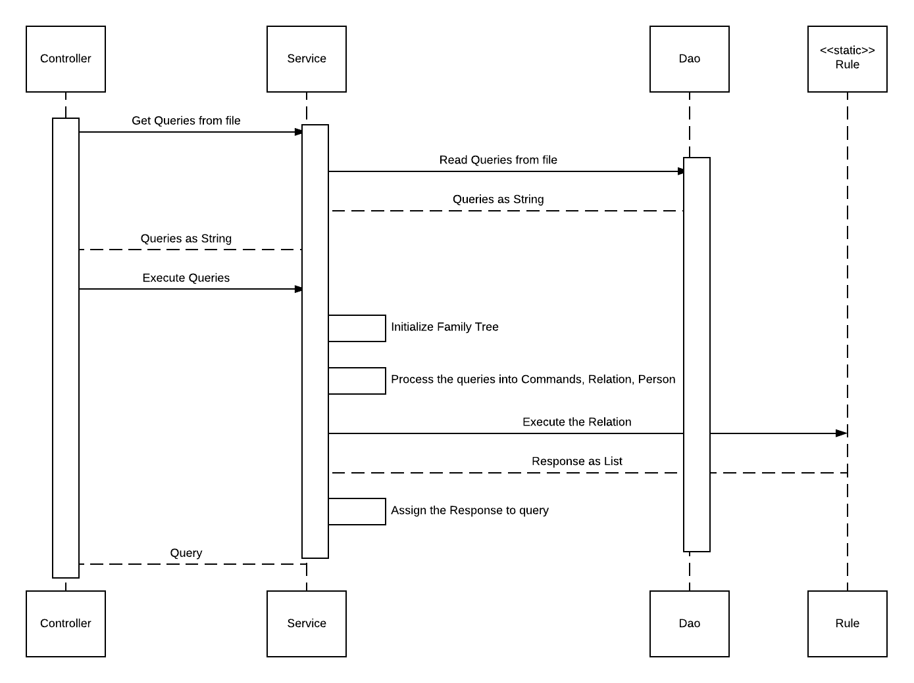

# Meet The Family
Solving the [Meet the family Problem 1](https://www.geektrust.in/coding-problem/backend/family)

# Build 
```
mvn clean install
```
# Run
```
java -jar target/geektrust.jar <path_of_test_file>
java -jar target/geektrust.jar src/main/resources/input.txt
```
# Test
Create test Commands of the format
```
ADD_CHILD <MotherName> <ChildName> <GENDER>
GET_RELATIONSHIP <Name> <RELATIONSHIP>
```
# Sequence Diagram


### Supported Genders
```
Male
Female
```
### Supported Relationships
```
Paternal-Uncle
Maternal-Uncle
Paternal-Aunt
Maternal-Aunt
Sister-In-Law
Brother-In-Law
Son
Daughter
Siblings
```

## Assumptions
This are the assumptions that has been taken in addition to the given assumptions.

### Query assumptions
 - no duplicates
 - pre validated query
 
### Design assumptions
 - can add child only if spouse exist
 - 